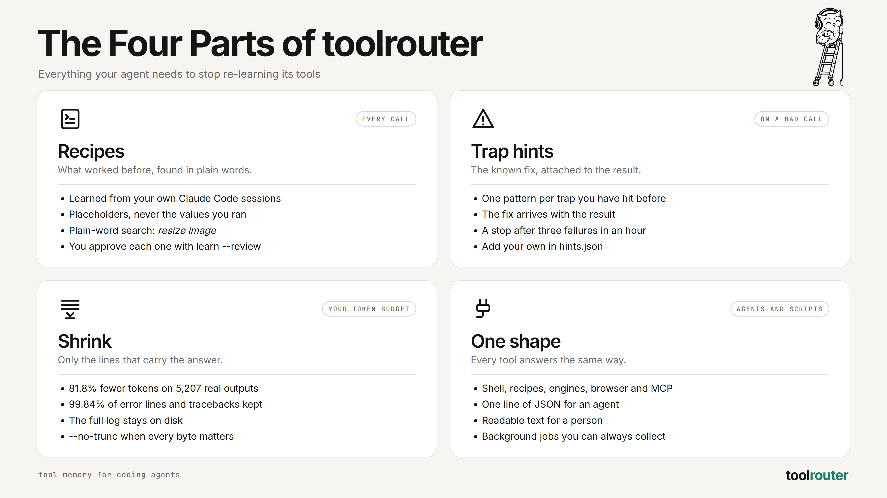

<p align="center">
  
</p>

<p align="center">
  <a href="#quickstart"><strong>Quickstart</strong></a> &middot;
  <a href="#use-with-claude-code-or-codex"><strong>Use with your agent</strong></a> &middot;
  <a href="#commands"><strong>Commands</strong></a> &middot;
  <a href="#compared-to"><strong>Compared to</strong></a> &middot;
  <a href="#docs"><strong>Docs</strong></a>
</p>

<p align="center">
  
  
  
</p>

<br>

<p align="center">
  
</p>

<p align="center"><i><code>pytest -v</code>: 261 lines in, 11 out, the failure kept.</i></p>

<p align="center">
  <picture>
    <source media="(prefers-color-scheme: dark)" srcset="https://github.com/Wasif-ZA/toolrouter/blob/main/assets/bench-dark.svg?raw=true">
    
  </picture>
</p>

<br>

# toolrouter is the tool memory your coding agent is missing.

Open-source glue between coding agents and the tools they call.

**If your agent is the _cook_, toolrouter is the _recipe book_.**

Your agent keeps rewriting the same commands, hitting the same traps, and reading 5,000 lines
to find one error. toolrouter remembers the commands that worked, attaches the fix it knows,
and hands back only the lines that matter. It looks like a command wrapper. Under the hood:
learned recipes, trap hints, output shrinking, engines, a browser and MCP, all answering in one
shape.

**Stop re-teaching your agent the same commands.**

|        | Step            | Example                                                                 |
| ------ | --------------- | ----------------------------------------------------------------------- |
| **01** | Install it      | _`uv tool install git+https://github.com/Wasif-ZA/toolrouter`_                                           |
| **02** | Tell your agent | _Paste [four lines](#use-with-claude-code-or-codex) into `CLAUDE.md` or `AGENTS.md`._ |
| **03** | Work as normal  | _Once a week, `toolrouter learn --review` and keep what is worth keeping._ |

> [!TIP]
> **🦉 Or hand the whole thing to your agent.** Paste this into Claude Code or Codex:
>
> ```text
> Install toolrouter with `uv tool install git+https://github.com/Wasif-ZA/toolrouter`.
> Then add the "Use with Claude Code or Codex" lines from its README to my CLAUDE.md
> (or AGENTS.md for Codex), and run `toolrouter` to show me the menu.
> ```

<br>

<div align="center">
<table>
  <tr>
    <td align="center" rowspan="2"><strong>Called<br>by</strong></td>
    <td align="center" valign="top"><picture><source media="(prefers-color-scheme: dark)" srcset="https://github.com/Wasif-ZA/toolrouter/blob/main/assets/logos/claude-dark.svg?raw=true"></picture><br><sub>Claude Code</sub></td>
    <td align="center" valign="top"><picture><source media="(prefers-color-scheme: dark)" srcset="https://github.com/Wasif-ZA/toolrouter/blob/main/assets/logos/openai-dark.svg?raw=true"></picture><br><sub>Codex</sub></td>
    <td align="center" rowspan="2"><strong>Talks<br>to</strong></td>
    <td align="center" valign="top"><picture><source media="(prefers-color-scheme: dark)" srcset="https://github.com/Wasif-ZA/toolrouter/blob/main/assets/logos/googlegemini-dark.svg?raw=true"></picture><br><sub>Gemini</sub></td>
    <td align="center" valign="top"><picture><source media="(prefers-color-scheme: dark)" srcset="https://github.com/Wasif-ZA/toolrouter/blob/main/assets/logos/ollama-dark.svg?raw=true"></picture><br><sub>Ollama</sub></td>
  </tr>
  <tr>
    <td align="center" valign="top"><sub>any agent<br>with a shell</sub></td>
    <td align="center" valign="top"><sub>you, at<br>a terminal</sub></td>
    <td align="center" valign="top"><picture><source media="(prefers-color-scheme: dark)" srcset="https://github.com/Wasif-ZA/toolrouter/blob/main/assets/logos/googlechrome-dark.svg?raw=true"></picture><br><sub>Chrome</sub></td>
    <td align="center" valign="top"><picture><source media="(prefers-color-scheme: dark)" srcset="https://github.com/Wasif-ZA/toolrouter/blob/main/assets/logos/modelcontextprotocol-dark.svg?raw=true"></picture><br><sub>MCP servers</sub></td>
  </tr>
</table>

<em>If it can run a shell command, it can use toolrouter.</em>

</div>

<br>

## toolrouter is right for you if

- ✅ Your agent writes the **same inline python** or curl command every session
- ✅ It **reads whole test logs** to find the one line that failed
- ✅ It walks into **the same trap twice**: wrong endpoint, wrong flag, wrong shell
- ✅ You run **Codex or Gemini from Claude Code** and want one answer shape back
- ✅ You start **background jobs** and forget to collect them
- ✅ You want to **see and approve** what your agent learns, not a hidden hook

<br>

## The four parts

Four things have to work for an agent to stop re-learning its tools: what worked before, what
went wrong before, how much it reads, and how every answer comes back. toolrouter is built
around exactly those four.

<picture>
  <source media="(prefers-color-scheme: dark)" srcset="https://github.com/Wasif-ZA/toolrouter/blob/main/assets/parts-dark.png?raw=true">
  
</picture>

| Part | Built for | What it does |
| --- | --- | --- |
| **Recipes**: what worked before | The agent, every call | Saved commands with placeholders, found by plain-word search, learned from your sessions |
| **Trap hints**: the known fix | The agent, on a bad call | The fix attached to the result, and a stop after three failures in a row |
| **Shrink**: errors and last lines | Your token budget | 81.8% fewer tokens, the answer lines kept, the full log on disk |
| **One shape**: same answer everywhere | Agents and scripts | One line of JSON for an agent, readable text for a person |

<br>

## See it work

Real output, captured from the commands shown.

<table>
<tr>
<td width="50%" valign="top"><br><sub><b>A failing test run: 261 lines in, the failure out</b></sub></td>
<td width="50%" valign="top"><br><sub><b>A known trap: the fix comes back with the result</b></sub></td>
</tr>
<tr>
<td width="50%" valign="top"><br><sub><b>Finding a recipe in plain words, then running it</b></sub></td>
<td width="50%" valign="top"><br><sub><b>The whole tool, from one bare command</b></sub></td>
</tr>
</table>

<br>

## Features

<table>
<tr>
<td align="center" width="33%" valign="top">
<h3>🧠 Learns your recipes</h3>
<code>toolrouter learn</code> reads your Claude Code sessions and finds the commands your agent keeps rewriting. You approve each one.
</td>
<td align="center" width="33%" valign="top">
<h3>🩹 Remembers the traps</h3>
When a command hits a trap it knows, the result carries the fix. Three failures in a row and it says stop and read the log.
</td>
<td align="center" width="33%" valign="top">
<h3>📉 Shrinks the output</h3>
81.8% fewer tokens on 5,207 real shell outputs, keeping 99.84% of error lines, tracebacks and last lines.
</td>
</tr>
<tr>
<td align="center" width="33%" valign="top">
<h3>🔌 One answer shape</h3>
Shell, recipes, Codex, a browser and MCP servers all come back as the same short result. The full log stays on disk.
</td>
<td align="center" width="33%" valign="top">
<h3>⏳ Background jobs</h3>
Start Codex with <code>--background</code>, keep working, then collect it with <code>toolrouter jobs &lt;id&gt; --wait</code> from any folder.
</td>
<td align="center" width="33%" valign="top">
<h3>🌐 Its own browser</h3>
<code>toolrouter browse</code> drives Chrome directly: open, look, click, type, read, screenshot. No Playwright.
</td>
</tr>
<tr>
<td align="center" width="33%" valign="top">
<h3>🔎 Plain-word search</h3>
<code>toolrouter search resize image</code> finds the recipe, so the agent stops guessing flags.
</td>
<td align="center" width="33%" valign="top">
<h3>↩️ Undo for edits</h3>
The <code>replace</code> and <code>json-set</code> recipes snapshot a file first. <code>toolrouter undo</code> puts it back.
</td>
<td align="center" width="33%" valign="top">
<h3>📦 Nothing to install with it</h3>
Python 3.10+ standard library. Only the <code>img</code> recipe wants Pillow.
</td>
</tr>
</table>

<br>

## Problems toolrouter solves

| Without toolrouter | With toolrouter |
| --- | --- |
| ❌ Every session your agent writes the same inline python to read one JSON field. | ✅ `toolrouter run json package.json .version`. One line, found by search, the same every time. |
| ❌ A failing test run dumps 5,000 lines into context to show one assertion. | ✅ `toolrouter exec` returns the failure and the summary. The rest is in a log file if it is needed. |
| ❌ Your agent hits the same wrong endpoint, flag or shell again, and you correct it again. | ✅ The trap is written down once. The next time, the result carries the fix. |
| ❌ The agent retries a broken command five times in a row. | ✅ After three failures in an hour, toolrouter tells it to stop and read the log. |
| ❌ Codex runs in the background and nobody collects the answer. | ✅ `toolrouter jobs <id> --wait` collects it from any folder, in the same shape as everything else. |
| ❌ A wrapper tool quietly rewrites commands and you cannot see what it learned. | ✅ No hook. Every recipe is a file you can read, and `learn --review` asks you first. |

<br>

## Why toolrouter is different

|                                   |                                                                                               |
| --------------------------------- | --------------------------------------------------------------------------------------------- |
| **Learned from your sessions.**   | Recipes come from your own Claude Code transcripts, not a generic catalogue.                  |
| **Shapes, not values.**           | A learned recipe keeps the command with `{1}` placeholders, never the values you ran it with. |
| **Only a person approves.**       | `learn --review` refuses to run inside an agent.                                             |
| **The answer lines survive.**     | Error lines, tracebacks, exit codes and last lines are kept: 99.84% on 5,207 real outputs.   |
| **Nothing is thrown away.**       | Every call keeps its full output on disk; the short result names the file.                  |
| **Reversible edits.**             | Recipe writes take a snapshot first. `toolrouter undo` restores it.                           |
| **No hook.**                      | It runs only when called, so it never changes how your agent works behind your back.         |

<br>

## What's under the hood

toolrouter is one command with eight parts, all in the Python standard library:

```
┌──────────────────────────────────────────────────────────────┐
│                          TOOLROUTER                          │
│                                                              │
│  ┌───────────┐  ┌───────────┐  ┌───────────┐  ┌───────────┐  │
│  │  exec and │  │  recipes  │  │ hints and │  │   learn   │  │
│  │   shrink  │  │           │  │  breaker  │  │           │  │
│  └───────────┘  └───────────┘  └───────────┘  └───────────┘  │
│  ┌───────────┐  ┌───────────┐  ┌───────────┐  ┌───────────┐  │
│  │engines and│  │   browse  │  │    mcp    │  │  undo and │  │
│  │    jobs   │  │           │  │           │  │   ingest  │  │
│  └───────────┘  └───────────┘  └───────────┘  └───────────┘  │
└──────────────────────────────────────────────────────────────┘
        ▲              ▲              ▲              ▲
  ┌───────────┐  ┌───────────┐  ┌───────────┐  ┌───────────┐
  │   Claude  │  │   Codex   │  │ you, at a │  │  scripts  │
  │    Code   │  │           │  │  terminal │  │   and CI  │
  └───────────┘  └───────────┘  └───────────┘  └───────────┘
```

### The parts

<details>
<summary>Open: what each of the eight parts does</summary>

<table>
<tr>
<td width="50%" valign="top">

**exec and shrink**: Runs the command through bash, keeps the full output in <code>~/.toolrouter/logs/</code>, and hands back the error lines, tracebacks, exit code and last lines.

</td>
<td width="50%" valign="top">

**Recipes**: Named commands with <code>{1}</code> placeholders. Seeds for json, replace, find, img, page, repo and the engines, plus your own from <code>add</code> and <code>learn</code>.

</td>
</tr>
<tr>
<td width="50%" valign="top">

**Hints and the breaker**: Patterns that match a known trap and attach the fix. After three failures of the same command in an hour, it tells the agent to stop and read the log.

</td>
<td width="50%" valign="top">

**learn**: Reads your Claude Code transcripts, turns repeated commands into placeholder shapes, and queues them for <code>learn --review</code>.

</td>
</tr>
<tr>
<td width="50%" valign="top">

**Engines and jobs**: Codex, Gemini and local Ollama models behind one recipe call. Background jobs are tracked, so nothing is left running unseen.

</td>
<td width="50%" valign="top">

**browse**: Its own Chrome driver over the DevTools pipe, standard library only. A blocked-hosts list keeps it off sites you name.

</td>
</tr>
<tr>
<td width="50%" valign="top">

**mcp**: Lists your MCP servers and their tools in one line each, calls a tool with JSON, and searches the public MCP registry in auto mode.

</td>
<td width="50%" valign="top">

**undo and ingest**: Snapshots before every recipe write. <code>ingest</code> shows where your agent's tool tokens actually go.

</td>
</tr>
</table>

</details>

<br>

## What toolrouter is not

|                               |                                                                                       |
| ----------------------------- | ------------------------------------------------------------------------------------- |
| **Not a hook.**               | It never intercepts commands. The agent calls it because its instructions say to.     |
| **Not an MCP router.**        | It calls MCP servers, but in 102 measured sessions MCP was 1.7% of the tokens an agent read. Shell output was 63%. |
| **Not a proxy.**              | It never sits between your agent and the model.                                       |
| **Not a lossless pipe.**      | The agent gets a short version. Use `--no-trunc` when every byte matters.             |
| **Not cross-platform yet.**   | Built and tested on Windows through Git Bash. See [Platforms](#platforms).            |

<br>

## Quickstart

Open source. Runs on your machine. No account.

### Install it yourself

```sh
uv tool install git+https://github.com/Wasif-ZA/toolrouter
# or
pip install git+https://github.com/Wasif-ZA/toolrouter
```

Run `toolrouter` for the menu.

## Use with Claude Code or Codex

There is no hook. The agent calls toolrouter because its instructions say to. Paste this into
`CLAUDE.md` (Claude Code) or `AGENTS.md` (Codex):

```markdown
## Tools
Run shell commands through toolrouter.
- Look for a saved recipe first: `toolrouter search <words>`, then `toolrouter run <recipe> ...`.
- Anything else: `toolrouter exec -- "<command>"`. Read the short result; it names the full log.
- A command that worked and will be needed again: `toolrouter add <name> -- '<command, {1} for arguments>'`.
- If toolrouter is missing or errors, run the plain command.
```

A person at a terminal gets readable text. An agent (`CLAUDECODE` or `AI_AGENT` set) gets one
line of JSON. `--json`, `--human` or `TOOLROUTER_OUTPUT` force either.

## Commands

<details>
<summary>Open: 15 commands, one per goal, and the two modes</summary>

| Goal | Command |
|------|---------|
| Run anything, get a short result | `toolrouter exec -- "pytest -q"` |
| Read the whole output | `toolrouter exec --no-trunc -- "<command>"` |
| Find a recipe in plain words | `toolrouter search resize image` |
| See every recipe | `toolrouter list` |
| Run a recipe | `toolrouter run json package.json .version` |
| Keep a command that worked | `toolrouter add count-lines -- 'wc -l < {1}'` |
| Check every recipe still works | `toolrouter check` |
| Put back the last edit | `toolrouter undo` |
| Ask Codex, wait or not | `toolrouter run codex "write tests for X" --background` |
| Collect a background job | `toolrouter jobs <id> --wait` |
| Drive a browser | `toolrouter browse open <url>`, then `look`, `click @n`, `type @n "x"`, `read`, `shot`, `close` |
| Call an MCP server | `toolrouter mcp <server> <tool> '{"a": 1}'` |
| Find an MCP server | `toolrouter mcp search <words>` |
| Find recipe candidates | `toolrouter learn`, then `toolrouter learn --review` |
| See where your tokens go | `toolrouter ingest --since 2026-09-27` |

### Two modes

- **learn** (default): only recipes you approved. `learn --review` asks yes or no for each one.
- **auto**: `toolrouter mode auto` adds a catalogue of 49 popular CLI recipes, `--help` lookup
  for anything on your PATH, and live search of the MCP registry. In this mode `learn` keeps
  candidates without asking.

</details>

## How it shrinks output

<p align="center">
  
</p>

<p align="center">
  <picture>
    <source media="(prefers-color-scheme: dark)" srcset="https://github.com/Wasif-ZA/toolrouter/blob/main/assets/bench-dark.svg?raw=true">
    
  </picture>
</p>

On 5,207 Bash outputs from real Claude Code transcripts:

| Kept line | Survived |
|-----------|---------:|
| Last line of output | 4,354 / 4,357 |
| Error lines | 331 / 335 |
| Tracebacks | 133 / 133 |
| Command not found, no such file | 108 / 108 |
| Exit codes | 127 / 128 |

Tokens are estimated as characters / 4. The corpus is one person's sessions, so your number
will differ: `python bench/shrink_bench.py` reruns it on yours.

## Compared to

| | Built around | How the agent uses it | Full output |
|---|---|---|---|
| **toolrouter** | Remembering how your agent calls tools: recipes, trap hints, engines | The agent calls it; no hook | Log file in `~/.toolrouter/logs/` |
| [rtk](https://github.com/rtk-ai/rtk) | Compact output for many common commands | A hook rewrites Bash commands | `rtk recall` |
| [Headroom](https://github.com/headroomlabs-ai/headroom) | Compressing everything sent to the model | Proxy, library or MCP | Cached locally |

If all you want is smaller shell output with no change to how the agent works, rtk's hook is
the shorter path.

## Platforms

<details>
<summary>Open: Windows tested, macOS and Linux untested</summary>

- **Windows**: built and tested here, through Git Bash.
- **macOS and Linux**: untested. `exec` needs `bash`; `browse` is Windows only for now.
- **Engines**: `codex` needs the Codex plugin for Claude Code. `gemini` and `local` still call
  scripts from the author's own setup and are not portable yet.

</details>

## Privacy

<details>
<summary>Open: what it reads, where it writes, what leaves your machine</summary>

- `learn` and `ingest` read your transcripts in `~/.claude/projects/` and stay on your machine.
- Logs, recipes, snapshots and jobs live in `~/.toolrouter/` (or `TOOLROUTER_HOME`).
- No telemetry. The network is used only when you ask for it: MCP registry search (auto
  mode), the `page` recipe (through r.jina.ai), `up`, `repo` (through `gh`), and the engines.

</details>

## Roadmap

- ⬜ `browse` on macOS and Linux
- ⬜ `gemini` and `local` engines that work outside the author's setup
- ⬜ Computer use: an agent cursor of its own that never takes over your mouse

## Docs

1. [`docs/measurement.md`](docs/measurement.md): where agent tokens actually go.
2. [`docs/benchmark.md`](docs/benchmark.md): the shrinker against Headroom and a plain cap.
3. [`docs/spec.md`](docs/spec.md): what gets built, in which order.
4. [`docs/architecture.md`](docs/architecture.md): how the lanes fit together.
5. [`docs/ideas.md`](docs/ideas.md): every idea raised and where it landed.
6. [`docs/decisions.md`](docs/decisions.md): what was cut and why.

Tests: `uv run --no-project --with pytest --with pillow python -m pytest -q`.
