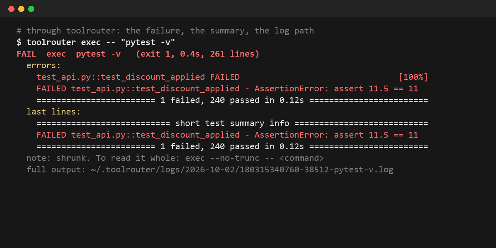
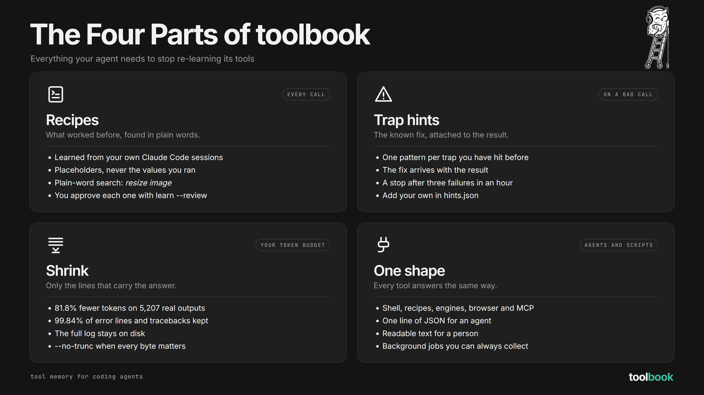
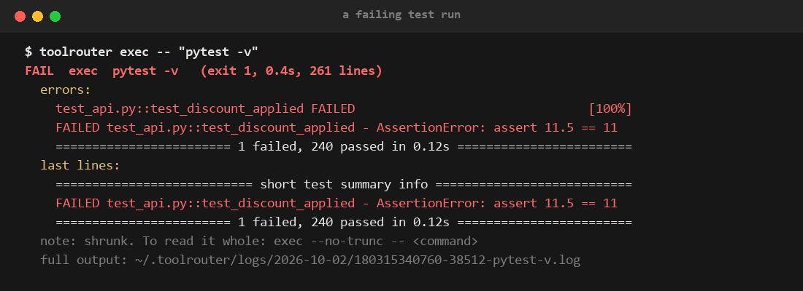
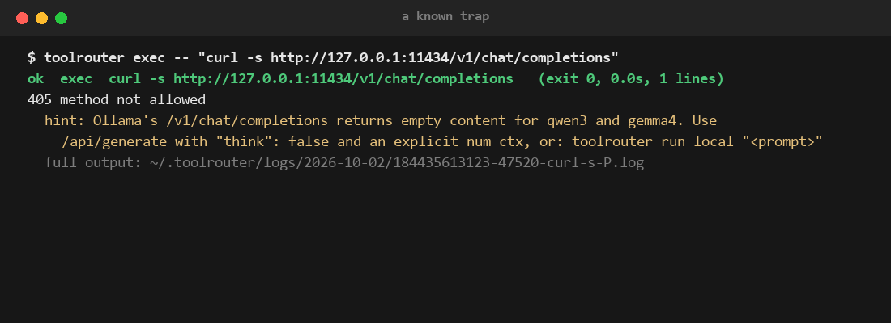
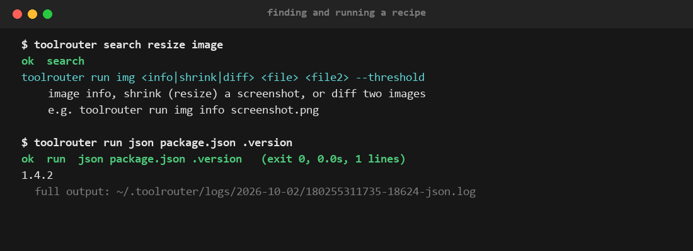
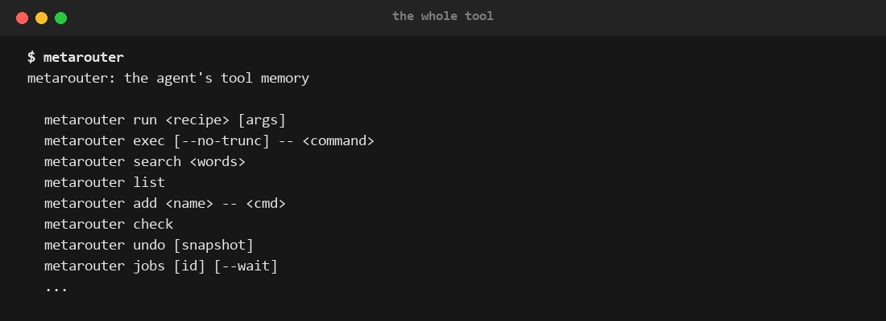

<p align="center">
  
</p>

<p align="center">
  <a href="#quickstart"><strong>Quickstart</strong></a> &middot;
  <a href="#use-with-claude-code-or-codex"><strong>Use with your agent</strong></a> &middot;
  <a href="#commands"><strong>Commands</strong></a> &middot;
  <a href="#compared-to"><strong>Compared to</strong></a> &middot;
  <a href="#docs"><strong>Docs</strong></a>
</p>

<p align="center">
  
  
  
</p>

<br>

<p align="center">
  
</p>

<p align="center"><i><code>pytest -v</code>: 261 lines in, 11 out, the failure kept.</i></p>

<br>

# metarouter is your coding agent's tool memory.

Open-source glue between coding agents and the tools they call.

**If your agent is the _driver_, metarouter is the _GPS_: it knows the route, and it knows the potholes.**

Your agent keeps rewriting the same commands and walking into the same traps. metarouter
remembers the commands that worked, warns before a command it knows will fail, and can undo its
own edits. It also hands back the lines that matter instead of 5,000. Under the hood: learned
recipes, trap hints, undo, output shrinking, engines, a browser and MCP, all answering in one
shape.

**Stop re-teaching your agent the same commands.**

|        | Step            | Example                                                                 |
| ------ | --------------- | ----------------------------------------------------------------------- |
| **01** | Install it      | _`uv tool install git+https://github.com/Wasif-ZA/metarouter`_           |
| **02** | Tell your agent | _Paste [four lines](#use-with-claude-code-or-codex) into `CLAUDE.md` or `AGENTS.md`._ |
| **03** | Work as normal  | _Once a week, `metarouter learn --review` and keep what is worth keeping._ |

> [!TIP]
> **🦉 Or hand the whole thing to your agent.** Paste this into Claude Code or Codex:
>
> ```text
> Install metarouter with `uv tool install git+https://github.com/Wasif-ZA/metarouter`.
> Then add the "Use with Claude Code or Codex" lines from its README to my CLAUDE.md
> (or AGENTS.md for Codex), and run `metarouter` to show me the menu.
> ```

<br>

<div align="center">
<table>
  <tr>
    <td align="center" rowspan="2"><strong>Called<br>by</strong></td>
    <td align="center" valign="top"><br><sub>Claude Code</sub></td>
    <td align="center" valign="top"><br><sub>Codex</sub></td>
    <td align="center" rowspan="2"><strong>Talks<br>to</strong></td>
    <td align="center" valign="top"><br><sub>Gemini</sub></td>
    <td align="center" valign="top"><br><sub>Ollama</sub></td>
  </tr>
  <tr>
    <td align="center" valign="top"><sub>any agent<br>with a shell</sub></td>
    <td align="center" valign="top"><sub>you, at<br>a terminal</sub></td>
    <td align="center" valign="top"><br><sub>Chrome</sub></td>
    <td align="center" valign="top"><br><sub>MCP servers</sub></td>
  </tr>
</table>

<em>If it can run a shell command, it can use metarouter.</em>

</div>

<br>

## metarouter is right for you if

- ✅ Your agent writes the **same inline python** or curl command every session
- ✅ It **reads whole test logs** to find the one line that failed
- ✅ It walks into **the same trap twice**: wrong endpoint, wrong flag, wrong shell
- ✅ You run **Codex or Gemini from Claude Code** and want one answer shape back
- ✅ You start **background jobs** and forget to collect them
- ✅ You want to **see and approve** what your agent learns, not a hidden hook

<br>

## The four parts

Four things have to work for an agent to stop re-learning its tools: what worked before, what
went wrong before, how much it reads, and how every answer comes back. metarouter is built
around exactly those four.



| Part | Built for | What it does |
| --- | --- | --- |
| **Recipes**: what worked before | The agent, every call | Saved commands with placeholders, found by plain-word search, learned from your sessions |
| **Trap hints**: the known fix | The agent, on a bad call | The fix attached to the result, and a stop after three failures in a row |
| **Shrink**: only the lines that matter | Your agent's attention | Less to read, the failure kept, the full log on disk. Not a promise of a smaller bill: see [Limits](#limits) |
| **One shape**: same answer everywhere | Agents and scripts | Plain text when the output is short, compact JSON when it was cut, readable text for a person |

<br>

## See it work

Real output, captured from the commands shown.

<table>
<tr>
<td width="50%" valign="top"><br><sub><b>A failing test run: 261 lines in, the failure out</b></sub></td>
<td width="50%" valign="top"><br><sub><b>A known trap: the fix comes back with the result</b></sub></td>
</tr>
<tr>
<td width="50%" valign="top"><br><sub><b>Finding a recipe in plain words, then running it</b></sub></td>
<td width="50%" valign="top"><br><sub><b>The whole tool, from one bare command</b></sub></td>
</tr>
</table>

<br>

## Features

<table>
<tr>
<td align="center" width="33%" valign="top">
<h3>🧠 Learns your recipes</h3>
<code>metarouter learn</code> reads your Claude Code sessions and finds the commands your agent keeps rewriting. You approve each one.
</td>
<td align="center" width="33%" valign="top">
<h3>🩹 Remembers the traps</h3>
When a command hits a trap it knows, the result carries the fix. Three failures in a row and it says stop and read the log.
</td>
<td align="center" width="33%" valign="top">
<h3>📉 Shrinks the output</h3>
On failed commands, 366 of 368 error lines, tracebacks and exit codes kept. <code>metarouter log --grep</code> reads the rest when needed.
</td>
</tr>
<tr>
<td align="center" width="33%" valign="top">
<h3>🔌 One answer shape</h3>
Shell, recipes, Codex, a browser and MCP servers all come back as the same short result. The full log stays on disk.
</td>
<td align="center" width="33%" valign="top">
<h3>⏳ Background jobs</h3>
Start Codex with <code>--background</code>, keep working, then collect it with <code>metarouter jobs &lt;id&gt; --wait</code> from any folder.
</td>
<td align="center" width="33%" valign="top">
<h3>🌐 Its own browser</h3>
<code>metarouter browse</code> drives Chrome directly: open, look, click, type, read, screenshot. No Playwright.
</td>
</tr>
<tr>
<td align="center" width="33%" valign="top">
<h3>🔎 Plain-word search</h3>
<code>metarouter search resize image</code> finds the recipe, so the agent stops guessing flags.
</td>
<td align="center" width="33%" valign="top">
<h3>↩️ Undo for edits</h3>
The <code>replace</code> and <code>json-set</code> recipes snapshot a file first. <code>metarouter undo</code> puts it back.
</td>
<td align="center" width="33%" valign="top">
<h3>📦 Nothing to install with it</h3>
Python 3.11+ standard library. Only the <code>img</code> recipe wants Pillow.
</td>
</tr>
</table>

<br>

## Problems metarouter solves

| Without metarouter | With metarouter |
| --- | --- |
| ❌ Every session your agent writes the same inline python to read one JSON field. | ✅ `metarouter run json package.json .version`. One line, found by search, the same every time. |
| ❌ A failing test run dumps 5,000 lines into context to show one assertion. | ✅ `metarouter exec` returns the failure and the summary. The rest is in a log file if it is needed. |
| ❌ Your agent hits the same wrong endpoint, flag or shell again, and you correct it again. | ✅ The trap is written down once. The next time, the result carries the fix. |
| ❌ The agent retries a broken command five times in a row. | ✅ After three failures in an hour, metarouter tells it to stop and read the log. With `--strict` it refuses the fourth run. |
| ❌ The agent dumps a whole saved log back into context to find one line. | ✅ `metarouter log --grep "Error"` or `--tail 40` returns just those lines. |
| ❌ Codex runs in the background and nobody collects the answer. | ✅ `metarouter jobs <id> --wait` collects it from any folder, in the same shape as everything else. |
| ❌ A wrapper tool quietly rewrites commands and you cannot see what it learned. | ✅ No hook. Every recipe is a file you can read, and `learn --review` asks you first. |

<br>

## Why metarouter is different

|                                   |                                                                                               |
| --------------------------------- | --------------------------------------------------------------------------------------------- |
| **Learned from your sessions.**   | Recipes come from your own Claude Code transcripts, not a generic catalogue.                  |
| **Shapes, not values.**           | A learned recipe keeps the command with `{1}` placeholders, never the values you ran it with. |
| **Only a person approves.**       | `learn --review` refuses to run inside an agent.                                             |
| **Warns before, not after.**      | A known trap is flagged on the command itself, before it runs.                                 |
| **The answer lines survive.**     | On a failed command, error lines, tracebacks and exit codes are kept: 366 of 368 on real outputs. |
| **Nothing is thrown away.**       | Every call keeps its full output on disk; the short result names the file.                  |
| **Reversible edits.**             | Recipe writes take a snapshot first. `metarouter undo` restores it.                           |
| **No hook.**                      | It runs only when called, so it never changes how your agent works behind your back.         |

<br>

## What's under the hood

metarouter is one command with eight parts, all in the Python standard library:

```
┌──────────────────────────────────────────────────────────────┐
│                          METAROUTER                          │
│                                                              │
│  ┌───────────┐  ┌───────────┐  ┌───────────┐  ┌───────────┐  │
│  │  exec and │  │  recipes  │  │ hints and │  │   learn   │  │
│  │   shrink  │  │           │  │  breaker  │  │           │  │
│  └───────────┘  └───────────┘  └───────────┘  └───────────┘  │
│  ┌───────────┐  ┌───────────┐  ┌───────────┐  ┌───────────┐  │
│  │engines and│  │   browse  │  │    mcp    │  │  undo and │  │
│  │    jobs   │  │           │  │           │  │   ingest  │  │
│  └───────────┘  └───────────┘  └───────────┘  └───────────┘  │
└──────────────────────────────────────────────────────────────┘
        ▲              ▲              ▲              ▲
  ┌───────────┐  ┌───────────┐  ┌───────────┐  ┌───────────┐
  │   Claude  │  │   Codex   │  │ you, at a │  │  scripts  │
  │    Code   │  │           │  │  terminal │  │   and CI  │
  └───────────┘  └───────────┘  └───────────┘  └───────────┘
```

### The parts

<details>
<summary>Open: what each of the eight parts does</summary>

<table>
<tr>
<td width="50%" valign="top">

**exec and shrink**: Runs the command through bash and keeps the full output in <code>~/.metarouter/logs/</code>. A failure comes back as its error lines, tracebacks, exit code and last lines. A long success is cut to its start and end, with repeated lines collapsed. Seven per-command filters (pytest, npm, pip, uv, git push/pull, gh run view, curl) trim known noise, and <code>--want</code> picks the parts that match your words.

</td>
<td width="50%" valign="top">

**Recipes**: Named commands with <code>{1}</code> placeholders. Seeds for json, json-set, replace, find, img, page, screenshot, up, repo and the engines, plus your own from <code>add</code> and <code>learn</code>.

</td>
</tr>
<tr>
<td width="50%" valign="top">

**Hints and the breaker**: Patterns that match a known trap and attach the fix. After three failures of the same command in an hour, it tells the agent to stop and read the log.

</td>
<td width="50%" valign="top">

**learn**: Reads your Claude Code transcripts, turns repeated commands into placeholder shapes, and queues them for <code>learn --review</code>.

</td>
</tr>
<tr>
<td width="50%" valign="top">

**Engines and jobs**: Codex, Gemini and local Ollama models behind one recipe call. Background jobs are tracked, so nothing is left running unseen.

</td>
<td width="50%" valign="top">

**browse**: Its own Chrome driver over the DevTools pipe, standard library only. A blocked-hosts list keeps it off sites you name.

</td>
</tr>
<tr>
<td width="50%" valign="top">

**mcp**: Lists your MCP servers and their tools in one line each and calls a tool with JSON. Local and HTTP servers both work. A helper keeps servers running between calls and stops after 30 idle minutes. In auto mode it also searches the public MCP registry.

</td>
<td width="50%" valign="top">

**undo, stats and ingest**: Snapshots before every recipe write. <code>stats</code> shows recipe runs, failures, and how often a hint was followed by a success. <code>ingest</code> shows where your agent's tool tokens actually go.

</td>
</tr>
</table>

</details>

<br>

## What metarouter is not

|                               |                                                                                       |
| ----------------------------- | ------------------------------------------------------------------------------------- |
| **Not a hook.**               | It never intercepts commands. The agent calls it because its instructions say to.     |
| **Not a model router.**       | It never picks which model answers. It routes tool calls: shell, recipes, engines, browser, MCP. |
| **Not a proxy.**              | It never sits between your agent and the model.                                       |
| **Not a lossless pipe.**      | The agent gets a short version. Use `--no-trunc` when every byte matters.             |
| **Not a proven cost cutter.** | It cuts what the agent reads. Whether that lowers your bill: see [Limits](#limits).  |
| **Not cross-platform yet.**   | Built and tested on Windows through Git Bash. See [Platforms](#platforms).            |

<br>

## Quickstart

Open source. Runs on your machine. No account.

### Install it yourself

Not on PyPI yet. Install from GitHub:

```sh
uv tool install git+https://github.com/Wasif-ZA/metarouter
# or
pip install git+https://github.com/Wasif-ZA/metarouter
```

Run `metarouter` for the menu.

## Use with Claude Code or Codex

There is no hook. The agent calls metarouter because its instructions say to. Paste this into
`CLAUDE.md` (Claude Code) or `AGENTS.md` (Codex):

```markdown
## Tools
Run shell commands through metarouter.
- Look for a saved recipe first: `metarouter search <words>`, then `metarouter run <recipe> ...`.
- Anything else: `metarouter exec -- "<command>"`. Read the short result; it names the full log.
- A command that worked and will be needed again: `metarouter add <name> -- '<command, {1} for arguments>'`.
- If metarouter is missing or errors, run the plain command.
```

A person at a terminal gets readable text. An agent (`CLAUDECODE` or `AI_AGENT` set) gets short
output as plain text, with `[exit N]` on top when it failed, and compact JSON when the output was
cut. `--json`, `--human` or `METAROUTER_OUTPUT` force either style.

## Commands

<details>
<summary>Open: 30 commands, one per goal, and the two modes</summary>

| Goal | Command |
|------|---------|
| Run anything, get a short result | `metarouter exec -- "pytest -q"` |
| Refuse a command that already failed three times | `metarouter exec --strict -- "<command>"`, or `"strict": true` in config |
| Read the whole output | `metarouter exec --no-trunc -- "<command>"` |
| Read part of the last saved output | `metarouter log --grep "Error"`, `metarouter log --tail 40`, `metarouter log 2` |
| Keep only the parts about a topic | `metarouter exec --want "timeout" -- "cat app.log"` |
| Run one command through PowerShell | `metarouter exec --shell powershell -- "Get-ChildItem"` |
| Find a recipe in plain words | `metarouter search resize image` |
| See every recipe | `metarouter list` |
| Run a recipe | `metarouter run json package.json .version` |
| Keep a command that worked | `metarouter add count-lines -- 'wc -l < {1}'` |
| Share your recipes | `metarouter export recipes.json`, then on the other machine `metarouter import recipes.json` |
| Check every recipe still works | `metarouter check` |
| Re-check only recipes whose CLI was upgraded | `metarouter check --changed` |
| Refuse or flag commands in a repo | `.metarouter/policy.json` with `{"refuse": ["git push --force"], "warn": ["rm -rf"]}`, then `metarouter policy` lists the rules |
| Try another engine when Codex or Gemini hits a usage limit | `"fallback": ["gemini", "local"]` in config |
| Hide tokens and keys in output (on by default) | `"shield": false` in config turns it off; the log keeps the raw text |
| Keep a recipe in the repo for the whole team | `metarouter add --project test-all -- "pytest -q"`; CI runs `metarouter check --project` |
| Add recipes and hints for a stack | `metarouter pack list`, `metarouter pack add git-worktrees`, `metarouter pack remove git-worktrees` |
| See the week in one screen | `metarouter digest --days 7` |
| Put back the last edit | `metarouter undo` |
| Ask Codex, wait or not | `metarouter run codex "write tests for X" --background` |
| Collect a background job | `metarouter jobs <id> --wait` |
| Drive a browser | `metarouter browse open <url>`, then `look`, `click @n`, `type @n "x"`, `read`, `shot`, `back`, `tabs`, `close` |
| Call an MCP server | `metarouter mcp <server> <tool> '{"a": 1}'` |
| Find an MCP server | `metarouter mcp search <words>` |
| Copy MCP servers in from your agent's config | `metarouter mcp import` |
| Stop the MCP helper | `metarouter mcp stop` |
| See a CLI's help or an MCP tool in one line | `metarouter tools <name>` |
| Switch mode | `metarouter mode auto` |
| Find recipe candidates | `metarouter learn`, then `metarouter learn --review` |
| See what your agent keeps rewriting | `metarouter learn --scan --days 30` |
| Add the instruction block to an agent | `metarouter init claude` (or codex, gemini, opencode, cursor, kiro, junie, copilot; `--project` for the repo file) |
| Take the block out again | `metarouter init --undo claude`, or `metarouter uninstall` for every one |
| Check the setup | `metarouter doctor` |
| See where your tokens go | `metarouter ingest --since 2026-09-27` |
| See what recipes and hints did | `metarouter stats --days 7 --here` |
| Prove metarouter helps on your repo | `metarouter ab --task "fix the failing test" --check "pytest -q" --runs 5` |

### Two modes

- **learn** (default): only recipes you approved. `learn --review` asks yes or no for each one.
- **auto**: `metarouter mode auto` adds a catalogue of 49 popular CLI recipes, `--help` lookup
  for anything on your PATH, and live search of the MCP registry. In this mode `learn` keeps
  candidates without asking.

</details>

## How it shrinks output

<p align="center">
  
</p>

On 6,069 Bash outputs from real Claude Code transcripts, the text the agent reads fell by 64.6%.
That is text, not money: see [Limits](#limits).

A failed command keeps what explains the failure:

| Kept line, failed commands | Survived |
|-----------|---------:|
| Exit codes | 146 / 146 |
| Tracebacks | 59 / 59 |
| Command not found, no such file | 48 / 48 |
| Error lines | 15 / 15 |
| Last line of output | 98 / 100 |

A command that succeeded is cut to about its first 1,200 and last 400 characters, after repeated
lines are collapsed. Words like "error" in the middle of a successful output (a grep hit, a test
name) can be cut. Use `--want <words>` or `--no-trunc` when you need them.

Tokens are estimated as characters / 4. The corpus is one person's sessions, so your number
will differ: `python bench/shrink_bench.py` reruns it on yours.

## Compared to

| | Built around | How the agent uses it | Full output |
|---|---|---|---|
| **metarouter** | Remembering how your agent calls tools: recipes, trap hints, engines | The agent calls it; no hook | Log file in `~/.metarouter/logs/` |
| [rtk](https://github.com/rtk-ai/rtk) | Compact output for many common commands | A hook rewrites Bash commands | `rtk recall` |
| [Headroom](https://github.com/headroomlabs-ai/headroom) | Compressing everything sent to the model | Proxy, library or MCP | Cached locally |
| [`headroom learn`](https://github.com/headroomlabs-ai/headroom#headroom-learn) | Mining failed sessions into notes | Writes fixes into `CLAUDE.local.md` | n/a |
| [treg](https://github.com/superdesigndev/treg) | A hosted catalogue of paid APIs and your team's tools | One token to a hosted registry, priced per call | On the server |

**Against `headroom learn`:** Headroom writes what went wrong as prose into an instruction file,
which the model rereads on every turn. metarouter keeps runnable commands with `{1}` blanks,
looks them up only when asked, flags a trap on the command before it runs, and can undo its own
edits.

**Against treg:** treg sells calls to other people's APIs and holds your team's keys on its
server. metarouter runs on your machine and learns from your own sessions. No account, no key
leaves your laptop, and nothing is billed per call.

If all you want is smaller shell output with no change to how the agent works, rtk's hook is
the shorter path.

## Limits

- **Shorter output is not a smaller bill.** An [independent test of rtk](https://quesma.com/blog/does-rtk-make-ai-coding-cheaper/)
  found shrinking shell output did not cut cost per task: tool output is a small share of input,
  cached reads are cheap, and one extra turn costs more than the trim saved. metarouter's own
  task-level test, with and without it, is in progress; the result will be posted here.
- **The 64.6% figure is characters / 4**, not billed tokens. `stats` labels it the same way.
- **It only helps when the agent calls it.** There is no hook, so an agent that ignores its
  instructions gets nothing.
- **Recipes and hints are only as good as what you approve.** `stats` shows how often a hint was
  followed by a success of the same tool.

## Platforms

<details>
<summary>Open: Windows tested, macOS and Linux untested</summary>

- **Windows**: built and tested here, through Git Bash. With no bash, commands run through PowerShell
  (`pwsh`, then `powershell`). Force it with `"shell": "powershell"` in config, or one call with
  `exec --shell powershell`. Recipes marked `"shell": "bash"` say so instead of failing oddly.
- **macOS and Linux**: untested. `exec` uses `bash`, else `sh`, else PowerShell. `browse` looks for Chrome or Chromium in the
  usual places, or `METAROUTER_CHROME`.
- **Engines**: `codex` needs the Codex plugin for Claude Code. `gemini` and `local` call a runner
  script you name in `~/.metarouter/config.json`: `"engines": {"gemini": "<path>", "local": "<path>"}`.

</details>

## Privacy

<details>
<summary>Open: what it reads, where it writes, what leaves your machine</summary>

- `learn` and `ingest` read your transcripts in `~/.claude/projects/` and stay on your machine.
- To keep folders or words out of everything metarouter learns or measures, list regexes in
  `~/.metarouter/config.json`: `"private": ["work/client-x", "secret-project"]`. Sessions,
  recipes and exports that match are skipped. Until you set one, `learn` and `ingest` print a
  warning.
- Logs, recipes, snapshots and jobs live in `~/.metarouter/` (or `METAROUTER_HOME`).
- No telemetry. The network is used only when you ask for it: MCP registry search (auto
  mode), the `page` recipe (through r.jina.ai), `up`, `repo` (through `gh`), and the engines.

</details>

## Roadmap

- ⬜ Task-level test: pass rate, turns and cost per passed task, with and without metarouter
- ⬜ Tested on macOS and Linux
- ⬜ Computer use: an agent cursor of its own that never takes over your mouse

## Tests

Tests: `uv run --no-project --with pytest --with pillow python -m pytest -q`.
