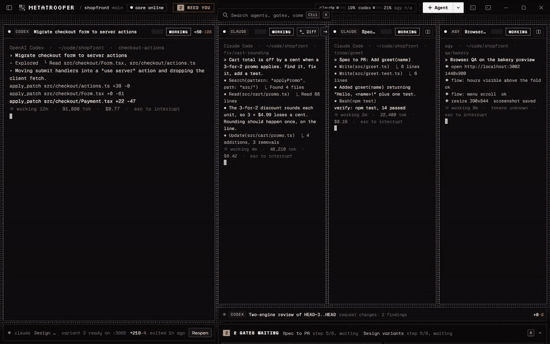
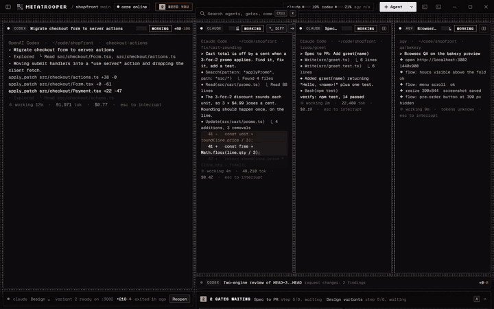
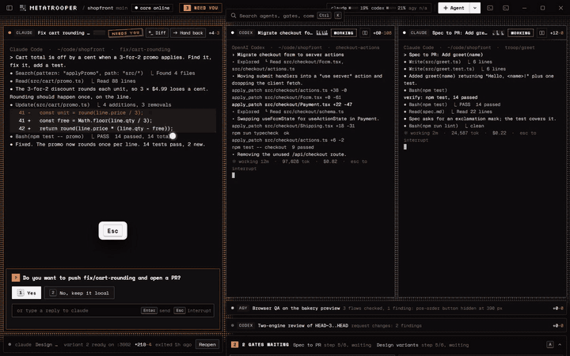
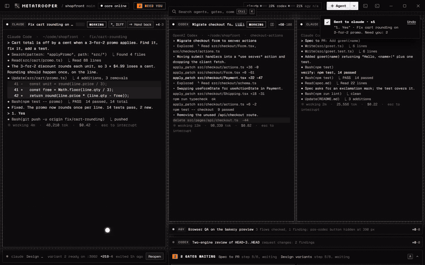
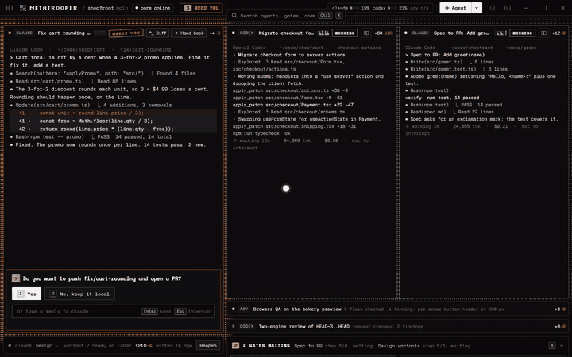
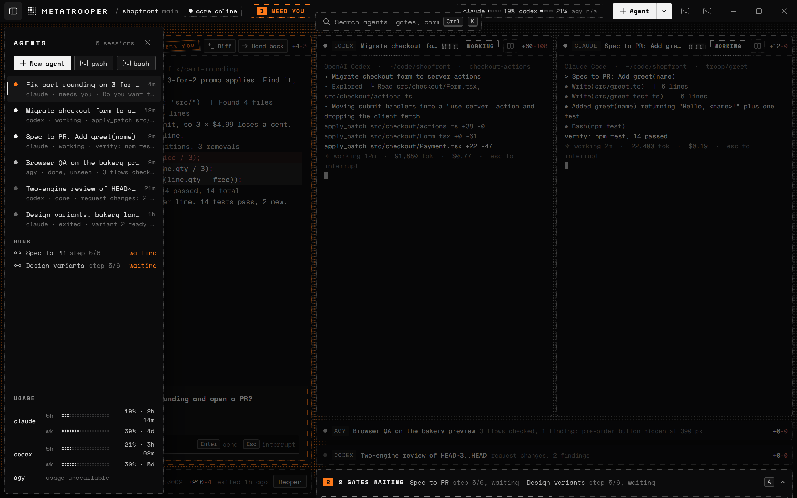

<p align="center"><strong>Windows and Linux (beta). Local only: no account, no telemetry.</strong></p>

<p align="center">
  
</p>

<p align="center">
  <strong>The desk where you run all your coding agents at once.</strong><br>
  Run Claude Code, Codex and Gemini side by side, each in a terminal that keeps going, with one place that tells you who needs you.
</p>

<p align="center">
  <a href="#quickstart"><strong>Quickstart</strong></a> &middot;
  <a href="#features"><strong>Features</strong></a> &middot;
  <a href="#use-it-from-your-agent"><strong>Use from your agent</strong></a> &middot;
  <a href="#commands"><strong>Commands</strong></a> &middot;
  <a href="#privacy"><strong>Privacy</strong></a> &middot;
  <a href="#known-limits"><strong>Known limits</strong></a> &middot;
  <a href="#docs"><strong>Docs</strong></a>
</p>

<p align="center">
  
  
  
  
</p>

<p align="center">
  <a href="assets/wall.png"></a>
</p>

<p align="center"><sub>The wall in <code>workbench/</code>, on demo data.</sub></p>

<br>

You run three agents in three terminals, lose track of which one is waiting on you, paste
screenshots back and forth, and type `/clear` when the context fills. MetaTrooper puts every
agent in a terminal it owns, shows you which one needs you, and opens each result beside the
agent that made it. Work runs through pipelines you can read and edit, with a stop before
anything leaves your machine.

**If your agents are the _troop_, MetaTrooper is the _base camp_.**

## Features

<table>
<tr>
<td width="50%" valign="middle">

### The one that needs you comes to you

Every agent is a live terminal on one wall. When one asks a question, its pane breathes orange and
glides to the big slot. Finished agents fold to one-line bars.

</td>
<td width="50%">
  
</td>
</tr>
<tr>
<td width="50%" valign="middle">

### Answer without switching windows

Pick an option or type a reply right in the pane. The agent carries on and the wall settles back.

</td>
<td width="50%">
  
</td>
</tr>
<tr>
<td width="50%" valign="middle">

### Gates you approve in one place

Pipelines stop before a PR, a deploy or a post. Waiting gates sit along the bottom; open the sheet and
approve. Only the window can approve, never an agent.

</td>
<td width="50%">
  
</td>
</tr>
<tr>
<td width="50%" valign="middle">

### Ctrl+K for everything

One search over agents, gates, commands and runs. Jump to any of them without the mouse.

</td>
<td width="50%">
  
</td>
</tr>
<tr>
<td width="50%" valign="middle">

### Every agent and its usage, on Ctrl+B

The agent list stays hidden until you want it: each session's state, the runs waiting on you, and
how much of each engine's limit you have used.

</td>
<td width="50%">
  <a href="assets/wall-list.png"></a>
</td>
</tr>
</table>

**Also in the box:**

- **Terminals that survive.** Close or crash the window and every agent keeps working; reopen it and the scrollback is there.
- **Status you can trust.** Read from each agent's own hooks, never guessed from its output. A state it cannot know says "state unknown".
- **One-click Resume.** If the core goes down, each session comes back as `exited` with Resume, through the engine's own resume flag.
- **Diffs per turn.** See what the last turn changed, what is uncommitted, or the whole branch. Your `git stash` list is untouched.
- **A browser your agents share.** Browser panes your agents drive through the `metatrooper-browser` MCP server, with full-page capture.
- **Worktrees on launch.** `--worktree <branch>` starts an agent in its own worktree, trusted in every engine that asks.
- **Plugins and importers.** Native `troop-plugin.json`, plus importers for Claude Code plugins and Codex and Gemini MCP config.

## Supported agents

Works with any interactive CLI agent a plugin can describe. Three ship built in:

<p>
  <kbd>Claude Code</kbd> &nbsp;
  <kbd>Codex CLI</kbd> &nbsp;
  <kbd>Antigravity CLI (agy)</kbd> &nbsp;
  <kbd> MCP servers and plugins</kbd>
</p>

<sub>MetaTrooper runs the official CLIs you install and sign in to yourself. It is not affiliated with or endorsed by
Anthropic, OpenAI or Google.</sub>

## MetaTrooper is right for you if

- ✅ You run **more than one agent at a time** and lose track of which one is waiting
- ✅ You **paste screenshots** into the chat so the agent can see what it built
- ✅ You type **`/clear`, `/resume` and "continue"** more than you would like
- ✅ You want **Codex and Gemini to review** what Claude wrote, without copying text between windows
- ✅ You want a **hard stop** before anything is pushed, deployed or posted
- ✅ You want to keep **your own subscriptions**, on your own machine, with no account to sign up for

## Problems MetaTrooper solves

| Without MetaTrooper | With MetaTrooper |
| --- | --- |
| ❌ Three agents in three terminals, and you find out ten minutes late that one asked you a question. | ✅ The inbox shows which session is waiting for you. |
| ❌ You close the wrong window and lose an agent mid-task. | ✅ The core owns the terminal. Reopen the window and it reattaches with scrollback. |
| ❌ You screenshot the page, paste it in, and ask "does this look right". | ✅ The agent drives a browser pane you can both see. |
| ❌ You copy Claude's diff into Codex, then into Gemini, then merge their notes by hand. | ✅ `two-engine-review` runs both reviews and buckets what each found. |
| ❌ An agent pushes or deploys before you have looked. | ✅ Gates stop the run. Only a click in the window resolves one. |
| ❌ You cannot tell what the agent actually changed this turn. | ✅ The Last turn diff shows exactly that. |

<br>

## Why MetaTrooper is different

|                                    |                                                                                                   |
| ---------------------------------- | ------------------------------------------------------------------------------------------------- |
| **Real CLIs, your subscriptions.** | It runs `claude`, `codex` and `agy` as you would by hand. No API keys, no headless mode.            |
| **A broken MetaTrooper is invisible.** | Every hook finishes within 250 ms, swallows every error and exits 0. Your agents never wait on it. |
| **No ports.**                      | Windows read a local SQLite file; commands go over a named pipe. No TCP port, token file or WebSocket. |
| **Pipelines are files.**           | A pipeline is a `pipeline.json` you can read, diff and edit in a form, with optional TypeScript steps. |
| **Local and free.**                | No account and no telemetry. The core is AGPL-3.0; the SDK, plugins, pipelines and public formats are MIT. |

<br>

## Quickstart

You need at least one of `claude`, `codex` or `agy` installed and signed in. MetaTrooper runs them; it never signs in
for you and never reads their login tokens.

### Windows: the installer

1. Download `MetaTrooper-Setup-<version>.exe` from [Releases](https://github.com/Wasif-ZA/metatrooper/releases) and
   run it. It installs for your user only, so there is no admin prompt, into `%LOCALAPPDATA%\Programs\MetaTrooper`.
   Node comes inside the app; you do not need your own.
2. Open MetaTrooper from the Start menu. The window starts the core for you.
3. First run asks how agents should start: **Ask before each tool call** (the default) or **Auto mode in MetaTrooper
   worktrees**. You can change it later in `~/.metatrooper/settings.json` (`sessions.approval`).

The installer puts `troop` (the command line) in `%LOCALAPPDATA%\MetaTrooper\bin`. There is no auto-update and no
update check, because that would be a network call: a new version is a new installer.

### Linux (beta) and Windows: from source

Node 24.16 or newer. On Linux, node-pty needs a C++ toolchain (`build-essential` on Ubuntu).

> [!TIP]
> **🪖 Just hand the whole thing to your agent.** Paste this into Claude Code or Codex:
>
> ```text
> Clone https://github.com/Wasif-ZA/metatrooper, run `npm ci` in core/ and workbench/,
> start the core with `node core/cli.ts serve`, then copy skills/troop into my agent's
> skills folder and run `node core/cli.ts engines` to show me which agents it found.
> ```

```bash
git clone https://github.com/Wasif-ZA/metatrooper
cd metatrooper/core && npm ci
node cli.ts serve                 # the core service; leave this terminal open
```

In a second terminal:

```bash
cd metatrooper/workbench && npm ci
npm run dev                       # the workbench window
```

#### Linux (beta, from source)

The steps above, on Ubuntu 24.04 or similar:

```bash
sudo apt install build-essential libsecret-tools   # node-pty's toolchain; secret-tool for plugin secrets
git clone https://github.com/Wasif-ZA/metatrooper
cd metatrooper/core && npm ci && cd ../workbench && npm ci && cd ..
node core/cli.ts serve &                            # the core service
workbench/bin/metatrooper.sh                         # the window, detached from this terminal
```

- Plugin secrets go to your keyring through `secret-tool`. Without it they are kept unencrypted in files only you
  can read (mode 0600) under `~/.metatrooper/secrets/`, and the plugin install screen says so.
- The shell tab is `bash`.
- If the window does not open and Electron reports the SUID sandbox helper, run
  `sudo chown root workbench/node_modules/electron/dist/chrome-sandbox && sudo chmod 4755 workbench/node_modules/electron/dist/chrome-sandbox`.

From source, `troop` below means `node core/cli.ts`.

> [!WARNING]
> **Two things happen on first run.** Launching Claude Code from the workbench installs
> MetaTrooper's hooks into `~/.claude/settings.json` (`troop hooks uninstall` takes them out again,
> leaving the rest of the file byte for byte). And the core keeps its state in
> `~/.metatrooper/troop.db`; a newer core migrates it, after which an older build cannot open it.

## Use it from your agent

Copy `skills/troop/` into your agent's skills folder (`~/.claude/skills/troop/` for Claude Code). It
teaches the agent to start a pipeline, wait on it, and report a gate to you instead of resolving it:

```bash
troop run start two-engine-review --project . --json
troop run wait <run_id> --json
```

## Commands

<details>
<summary>Open: every <code>troop</code> command</summary>

| You want to | Run |
|---|---|
| Start the core | `troop serve` |
| Check it is up | `troop ping` |
| Register a project folder | `troop open [path]` |
| Start an agent | `troop launch claude --project <path> --prompt "<text>"` |
| Start an agent in its own worktree | `troop launch codex --worktree <branch>` |
| Start several at once | `troop launch --jobs jobs.json` |
| List sessions | `troop sessions [--all]` |
| Act on a session | `troop focus\|seen\|hide <id>` |
| See which agents work | `troop engines [--check]` |
| Run a pipeline | `troop run start <pipeline> --input key=value` |
| Wait for it to pause or end | `troop run wait <run> [--timeout <s>]` |
| See a run's state and gates | `troop run status <run>` |
| Install or remove hooks | `troop hooks install\|uninstall [--codex]` |
| Add a plugin | `troop plugin install <folder\|git URL\|claude-import:<folder>>` |
| Give a plugin a secret | `troop plugin secret <id> <NAME>` |
| Usage numbers for the last 14 days | `troop gate` |
| Stop the core | `troop stop` |

Add `--json` to any command for one line of JSON.

### Approval profiles

`--approval ask|edits|contained` on `launch`. A new install starts every agent in `ask` (each tool call needs your
OK) unless you picked auto mode at first run; `contained` runs the engine's auto mode on a MetaTrooper worktree. A
settings file from an older version keeps its value.

Folders you list in `sessions.ask_paths` in `~/.metatrooper/settings.json` always start in `ask`, whatever was
requested, as does a folder holding one of them one or two levels down. Engines that send your code to another
company (`codex`, `agy`) also ask anywhere under the folder two levels above a listed path. The list is empty by
default:

```json
{ "sessions": { "ask_paths": ["C:/Users/you/notes/work/client"] } }
```

</details>

## How it works

Four things have to work for one person to run several agents without becoming the glue: the agent
keeps running, you know which one needs you, you can see what it made, and the steps between agents
run themselves.


| Part | Built for | What it does |
| --- | --- | --- |
| **Terminals**: agents keep running | Every agent | Each agent runs in a terminal the core owns. Close the window and it keeps working; reopen it and the scrollback is there |
| **Status**: who needs you | You, at a glance | Each session shows `working`, `waiting for you`, `done` or `exited`, read from the agent's own hooks, never guessed from its output |
| **Panes**: see what it made | Your review | Results open beside the agent: a browser, a diff (last turn, uncommitted, whole branch), a document, rows, findings |
| **Pipelines**: steps run themselves | Repeated work | Steps hand files to each other; a gate stops the run until you approve |


## Pipelines

Five built-ins ship in `pipelines/` and are ready on first run:


| Pipeline | Steps |
|---|---|
| `spec-to-pr` | spec, **approve spec**, build, verify, **approve PR**, open PR |
| `spec-build-review-handback` | spec, **approve spec**, build, verify, two-engine review, fix, re-verify, re-review, a hand-back list for you |
| `two-engine-review` | diff, **approve what is sent**, Codex review, Gemini review, bucket what each found |
| `e2e-browser-qa` | flows, QA, fix, re-verify, report |
| `pr-review-fix` (Pro) | Codex and Gemini review a PR, **pick findings**, Claude fixes them, a finding counts as fixed only with proof, re-review, hand-back |

**Bold** steps are gates. Each step starts a fresh agent session and gets the previous step's files.
The format is `contracts/pipeline.schema.json`.

Ten more are preview templates in `pipelines/preview/`: `website-build`, `design-variants`, `footage-to-edit`,
`docs-and-release-notes`, `security-review-and-upgrade`, `clips-to-scheduled-posts`, `seo-audit-fix`,
`deep-research-cited`, `data-to-dashboard` and `form-fill-batch`. They are listed in the template gallery and run once
you copy the file into `<project>/.troop/pipelines/` and enable the plugins it names. They get less testing than the
built-ins.

Thirteen plugins ship in `plugins/`: `agent-reach`, `cite-check`, `data`, `deploy`, `desktop`, `docs-export`,
`github`, `gmail`, `media`, `repo`, `security`, `seo` and `social-scheduler`, plus `optional/code-map`.
[metarouter](https://github.com/Wasif-ZA/metarouter) plugs in as one more, for recipes and smaller shell output.

## Pro

Pro adds the `pr-review-fix` pipeline. It is a paid add-on and is not on sale yet. When it is, you paste a licence
key and press Activate: that makes one call to the licence server, the result is cached in
`~/.metatrooper/pro.json`, and it is checked again only when you press Refresh or the cached expiry passes. Nothing
else in MetaTrooper needs Pro or an account.

## Platforms

- **Windows**: the installer, built and tested here (node-pty over ConPTY, named pipes, DPAPI for plugin
  secrets).
- **Linux (beta)**: install from source. The core's tests run on Ubuntu 24.04; the window gets less testing there.
  A packaged Linux build follows.
- **macOS**: not supported.
- **Engines**: `claude` reports state through hooks, `codex` through its notify setting, `agy` through
  file activity. `agy` has no prompt argument, so the prompt is typed into its terminal once.

## Privacy

- **What leaves your machine.** The core and the window make no network connection of their own. Your agents
  (`claude`, `codex`, `agy`) talk to their own vendors, as they do outside MetaTrooper. Plugins with the `network`
  permission connect where their install screen says, and only after you approve that permission.
- **Two exceptions.** (1) When Windows "Automatically detect settings" is on, the window's Chromium looks up the LAN
  host `wpad`, as Chrome and Edge do, so the browser pane works behind an auto-detected proxy. (2) Pro activation
  makes one call when you press Activate or Refresh (see [Pro](#pro)).
- **The proof.** `workbench/test/no-network.test.ts` runs a whole `spec-to-pr` pipeline with fake engines in the
  real window and fails if the core or Node opens any outbound connection, or if Chromium's network log names any
  host other than localhost and `wpad`. Rerun it on Windows with the workbench dependencies installed:

  ```bash
  cd workbench && node --test test/no-network.test.ts
  ```

- **Plugins that use the network**:

  | Plugin | Sends to |
  |---|---|
  | `agent-reach` | Exa search (through `mcporter`), GitHub search (through `gh`), and the pages it fetches |
  | `cite-check` | each source URL it checks |
  | `deploy` | Vercel, through the `vercel` CLI |
  | `github` | GitHub, through the `gh` CLI |
  | `gmail` | `accounts.google.com`, `oauth2.googleapis.com`, `gmail.googleapis.com` |
  | `media` | the URL you give it (through `yt-dlp`) |
  | `security` | the npm registry (through `npm outdated` and `npm ls`) |
  | `seo` | the site you audit, same origin only |
  | `social-scheduler` | your Postiz server (`POSTIZ_URL`, default `api.postiz.com`) |

  `data`, `desktop`, `docs-export`, `repo` and `optional/code-map` make no network connection.
- **What it stores.** State lives in `~/.metatrooper/` (`troop.db`, `settings.json`, `logs/`). The only thing
  written into a project is `<project>/.troop/runs/`, which is git-excluded automatically. Hooks store redacted
  events. On Windows, plugin secrets are encrypted with your login (DPAPI).

## Logs

Everything is in `~/.metatrooper/logs/`: `core.log`, `workbench.log`, `event-errors.log` (hook events the core
could not store) and `plugin-output.log`. Each file rotates at 5 MB and keeps two old copies. Secret values a plugin
was given are masked before they are written. In the window, Ctrl+K then "Open logs folder" opens it. Attach an
excerpt, secrets removed, to a [bug report](https://github.com/Wasif-ZA/metatrooper/issues/new?template=bug.yml).

## Uninstall

- **Installer**: Windows Settings, Apps, MetaTrooper, Uninstall. It first runs `troop hooks uninstall --codex --yes`,
  so `~/.claude/settings.json` and `~/.codex/config.toml` go back to exactly what they were, then removes the app, the
  `troop` folder from PATH and the shortcuts. A box (unticked) also deletes `~/.metatrooper/` and its worktrees;
  leave it unticked to keep your history.
- **From source**: run `node core/cli.ts hooks uninstall --codex`, stop the core with `node core/cli.ts stop`, and
  delete the clone. Delete `~/.metatrooper/` too if you want your history gone.

## Known limits

These are known and accepted for now; please do not file them as new bugs.

- **The browser pane trusts the pid a caller reports.** `browser.hello` checks that the session's process is an
  ancestor of the pid it is given, but takes that pid on the caller's word. A process running as your own user can
  claim another session's browser. It could read your files anyway, and a real check needs a native module.
- **A sandboxed session can lose its last event.** When a sandboxed session exits, a final event line it had not
  finished writing is dropped from the spool.
- **A failed print-mode step can lose its last line after a core restart.** The step's error detail includes the
  terminal's last line, which is kept in memory only, so after a core restart the failure shows the bare error.
- **No sandbox for agents' code yet.** Agents and the commands they run use your machine with your permissions;
  `ask` and the gates are the guard rails (see the roadmap).

## Licence

| Folder | Licence |
|---|---|
| `core/`, `workbench/`, `sandbox/`, and anything without its own file (root `LICENSE`) | AGPL-3.0-only |
| `sdk/`, `pipelines/`, `plugins/*/`, `skills/`, `engines/` | MIT |
| `contracts/` | MIT for the public formats listed in `contracts/LICENSE-MIT`; the rest follows the root licence |
| Third-party code and fonts in the app | their own licences, listed in [`THIRD-PARTY-NOTICES.md`](THIRD-PARTY-NOTICES.md) |

Security reports: [`SECURITY.md`](SECURITY.md). Contributing: [`CONTRIBUTING.md`](CONTRIBUTING.md).

## Roadmap

- ⬜ A sandbox for the code your agents run (not built yet): the agents stay on your machine as now, and the builds,
  tests and dev servers they start run in one Docker container per project, with an Open sandbox button in the
  window for a terminal and the files inside it
- ⬜ Each pipeline gets its own screen, starting with Spec to PR
- ⬜ A packaged Linux build
- ⬜ Using your terminals from a phone

## Docs

1. [`spec.md`](spec.md): what gets built, in which order, and every decision behind it.
2. [`contracts/`](contracts/): the exact formats: database schema, hooks, pipe protocol, pipelines,
   plugins, browser tools.
3. [`workbench/README.md`](workbench/README.md): running and testing the window.
4. [`ide-layer-research/`](ide-layer-research/): demand, integration and vendor-terms research (the pipeline research moved to `../suite-of-products/shared/research/`).
5. [`status/M1-STATUS.md`](status/M1-STATUS.md) to [`status/M5-STATUS.md`](status/M5-STATUS.md), [`status/UI-STATUS.md`](status/UI-STATUS.md):
   what is verified, and on which platform.

Tests: `METATROOPER_FAKE_DPAPI=1 npm test` in `core/`, `npm test` in `workbench/`.
