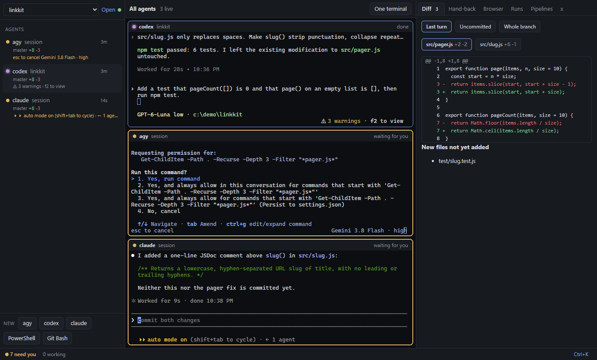
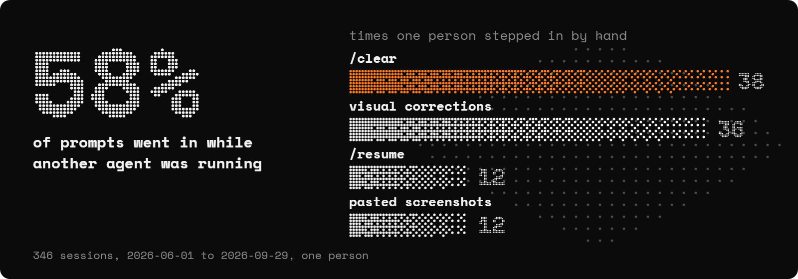
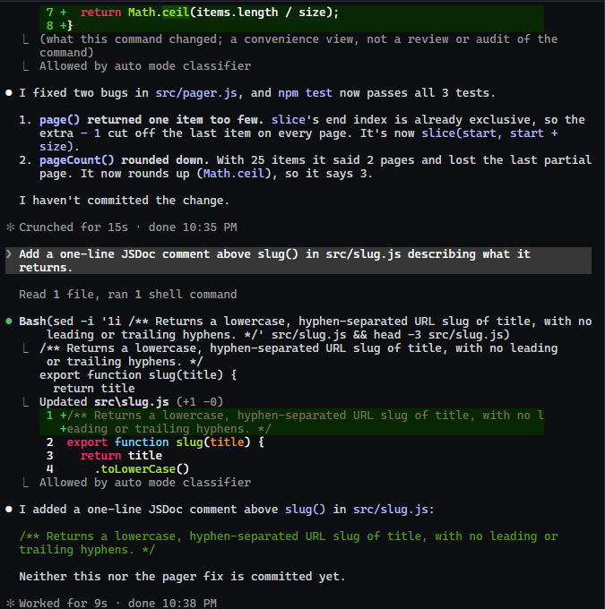
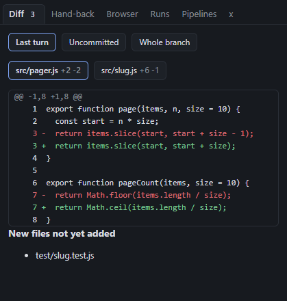
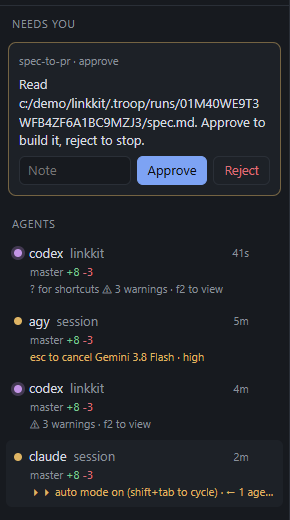
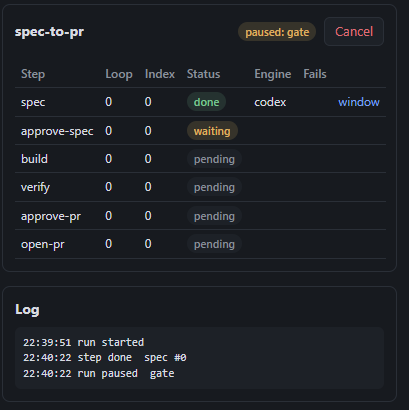
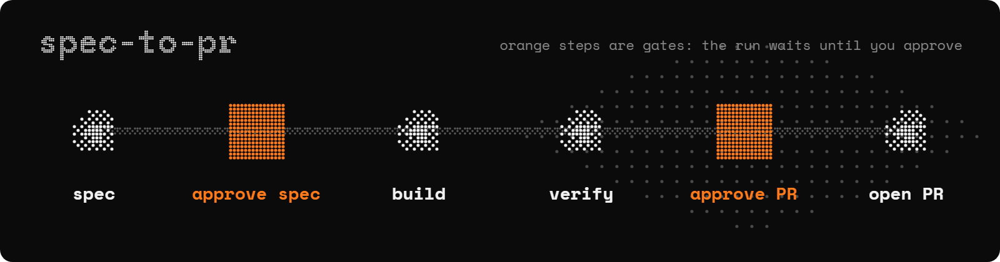

<p align="center">
  
</p>

<p align="center">
  <a href="#quickstart"><strong>Quickstart</strong></a> &middot;
  <a href="#use-it-from-your-agent"><strong>Use from your agent</strong></a> &middot;
  <a href="#commands"><strong>Commands</strong></a> &middot;
  <a href="#pipelines"><strong>Pipelines</strong></a> &middot;
  <a href="#docs"><strong>Docs</strong></a>
</p>

<p align="center">
  
  
  
  
</p>

<br>

<p align="center">
  <a href="assets/product.png"></a>
</p>

<p align="center">
  
</p>

<br>

# MetaTrooper is the desk where you run all your coding agents at once.

A desktop workbench for Claude Code, Codex and Gemini.

**If your agents are the _troop_, MetaTrooper is the _base camp_.**

You run three agents in three terminals, lose track of which one is waiting on you, paste
screenshots back and forth, and type `/clear` when the context fills. MetaTrooper puts every
agent in a terminal it owns, shows you which one needs you, and opens each result beside the
agent that made it. Work runs through pipelines you can read and edit, with a stop before
anything leaves your machine.

**Stop being the glue between your agents.**

|        | Step              | Example                                                                  |
| ------ | ----------------- | ------------------------------------------------------------------------ |
| **01** | Start the core    | _`node core/cli.ts serve`_                                               |
| **02** | Open the workbench | _`npm run dev` in `workbench/`_                                         |
| **03** | Launch an agent   | _Pick Claude Code, Codex or Gemini, or run a [pipeline](#pipelines)._    |

> [!TIP]
> **🪖 Or hand the whole thing to your agent.** Paste this into Claude Code or Codex:
>
> ```text
> Clone https://github.com/Wasif-ZA/metatrooper, run `npm install` in core/ and workbench/,
> start the core with `node core/cli.ts serve`, then copy skills/troop into my agent's
> skills folder and run `node core/cli.ts engines` to show me which agents it found.
> ```

<br>

<div align="center">
<table>
  <tr>
    <td align="center"><strong>Runs</strong></td>
    <td align="center" valign="top"><br><sub>Claude Code</sub></td>
    <td align="center" valign="top"><br><sub>Codex</sub></td>
    <td align="center" valign="top"><br><sub>Gemini (agy)</sub></td>
    <td align="center"><strong>Plugs<br>in</strong></td>
    <td align="center" valign="top"><br><sub>MCP servers<br>and plugins</sub></td>
  </tr>
</table>

<em>If it is an interactive CLI, a plugin can add it as an engine.</em>

</div>

<br>

## MetaTrooper is right for you if

- ✅ You run **more than one agent at a time** and lose track of which one is waiting
- ✅ You **paste screenshots** into the chat so the agent can see what it built
- ✅ You type **`/clear`, `/resume` and "continue"** more than you would like
- ✅ You want **Codex and Gemini to review** what Claude wrote, without copying text between windows
- ✅ You want a **hard stop** before anything is pushed, deployed or posted
- ✅ You want to keep **your own subscriptions**, on Windows, with no account to sign up for

These come from one person's numbers: over 346 agent sessions (2026-06-01 to 2026-09-29), 58% of
prompts were sent while another session was live, and there were 38 `/clear`, 12 `/resume`, 36
visual corrections and 12 pasted screenshots.

<br>

## The four parts

Four things have to work for one person to run several agents without becoming the glue: the agent
keeps running, you know which one needs you, you can see what it made, and the steps between agents
run themselves.


| Part | Built for | What it does |
| --- | --- | --- |
| **Terminals**: agents keep running | Every agent | Each agent runs in a terminal the core owns. Close the window and it keeps working; reopen it and the scrollback is there |
| **Status**: who needs you | You, at a glance | Each session shows `working`, `waiting for you`, `done` or `exited`, read from the agent's own hooks, never guessed from its output |
| **Panes**: see what it made | Your review | Results open beside the agent: a browser, a diff (last turn, uncommitted, whole branch), a document, rows, findings |
| **Pipelines**: steps run themselves | Repeated work | Steps hand files to each other; a gate stops the run until you approve |

<br>

## Features

<table>
<tr>
<td align="center" width="33%" valign="top">
<h3>🖥️ Terminals that survive</h3>
Agents run in real interactive CLIs inside the app. Closing or crashing the window leaves every one working.
</td>
<td align="center" width="33%" valign="top">
<h3>🚦 Status you can trust</h3>
An inbox of done, failed and waiting sessions. A state it cannot know says "state unknown", never green.
</td>
<td align="center" width="33%" valign="top">
<h3>↩️ One-click Resume</h3>
If the core goes down, each session comes back as <code>exited</code> with Resume, through the engine's own resume flag.
</td>
</tr>
<tr>
<td align="center" width="33%" valign="top">
<h3>🌐 A browser your agents share</h3>
Browser panes your agents drive through the <code>metatrooper-browser</code> MCP server, with full-page capture. You watch it happen.
</td>
<td align="center" width="33%" valign="top">
<h3>🔀 Diffs per turn</h3>
See what the last turn changed, what is uncommitted, or the whole branch. Your <code>git stash</code> list is untouched.
</td>
<td align="center" width="33%" valign="top">
<h3>🛑 Gates before anything external</h3>
A pipeline stops for your approval before a PR, a deploy or a post. Only the window can approve; an agent cannot.
</td>
</tr>
<tr>
<td align="center" width="33%" valign="top">
<h3>🧩 Plugins and importers</h3>
Native <code>troop-plugin.json</code>, plus importers for Claude Code plugins and Codex and Gemini MCP config.
</td>
<td align="center" width="33%" valign="top">
<h3>🌳 Worktrees on launch</h3>
<code>--worktree &lt;branch&gt;</code> starts an agent in its own worktree, trusted in every engine that asks.
</td>
<td align="center" width="33%" valign="top">
<h3>⌨️ Ctrl+K for everything</h3>
Launch agents, run pipelines, open shells. Five themes; settings live in one JSON file.
</td>
</tr>
</table>

<br>

## See it work

Real screens from one session on a small demo project.

<table>
<tr>
<td width="50%" valign="top"><br><sub><b>An agent fixes a bug and says what it changed</b></sub></td>
<td width="50%" valign="top"><br><sub><b>The diff of the last turn, beside the agent</b></sub></td>
</tr>
<tr>
<td width="50%" valign="top"><br><sub><b>A gate waits for you: approve or reject</b></sub></td>
<td width="50%" valign="top"><br><sub><b>The run, paused at the gate, step by step</b></sub></td>
</tr>
</table>

<br>

## Problems MetaTrooper solves

| Without MetaTrooper | With MetaTrooper |
| --- | --- |
| ❌ Three agents in three terminals, and you find out ten minutes late that one asked you a question. | ✅ The inbox shows which session is waiting for you. |
| ❌ You close the wrong window and lose an agent mid-task. | ✅ The core owns the terminal. Reopen the window and it reattaches with scrollback. |
| ❌ You screenshot the page, paste it in, and ask "does this look right". | ✅ The agent drives a browser pane you can both see. |
| ❌ You copy Claude's diff into Codex, then into Gemini, then merge their notes by hand. | ✅ `two-engine-review` runs both reviews and buckets what each found. |
| ❌ An agent pushes or deploys before you have looked. | ✅ Gates stop the run. Only a click in the window resolves one. |
| ❌ You cannot tell what the agent actually changed this turn. | ✅ The Last turn diff shows exactly that. |

<br>

## Why MetaTrooper is different

|                                    |                                                                                                   |
| ---------------------------------- | ------------------------------------------------------------------------------------------------- |
| **Real CLIs, your subscriptions.** | It runs `claude`, `codex` and `agy` as you would by hand. No API keys, no headless mode.            |
| **A broken MetaTrooper is invisible.** | Every hook finishes within 250 ms, swallows every error and exits 0. Your agents never wait on it. |
| **No ports.**                      | Windows read a local SQLite file; commands go over a named pipe. No TCP port, token file or WebSocket. |
| **Pipelines are files.**           | A pipeline is a `pipeline.json` you can read, diff and edit in a form, with optional TypeScript steps. |
| **Local and free.**                | No account and no telemetry. The core is AGPL-3.0; the SDK, contracts and pipelines are MIT.        |

<br>

## Quickstart

Windows, Node 24.16 or newer, and at least one of `claude`, `codex` or `agy` on your PATH.

```bash
git clone https://github.com/Wasif-ZA/metatrooper
cd metatrooper/core && npm install
node cli.ts serve                 # the core service; leave this terminal open
```

In a second terminal:

```bash
cd metatrooper/workbench && npm install
npm run dev                       # the workbench window
```

There is no installer yet; `troop` below means `node core/cli.ts`.

> [!WARNING]
> **Two things happen on first run.** Launching Claude Code from the workbench installs
> MetaTrooper's hooks into `~/.claude/settings.json` (`troop hooks uninstall` takes them out again,
> leaving the rest of the file byte for byte). And the core keeps its state in
> `~/.metatrooper/troop.db`; a newer core migrates it, after which an older build cannot open it.

## Use it from your agent

Copy `skills/troop/` into your agent's skills folder (`~/.claude/skills/troop/` for Claude Code). It
teaches the agent to start a pipeline, wait on it, and report a gate to you instead of resolving it:

```bash
troop run start two-engine-review --project . --json
troop run wait <run_id> --json
```

## Commands

<details>
<summary>Open: every <code>troop</code> command</summary>

| You want to | Run |
|---|---|
| Start the core | `troop serve` |
| Check it is up | `troop ping` |
| Register a project folder | `troop open [path]` |
| Start an agent | `troop launch claude --project <path> --prompt "<text>"` |
| Start an agent in its own worktree | `troop launch codex --worktree <branch>` |
| Start several at once | `troop launch --jobs jobs.json` |
| List sessions | `troop sessions [--all]` |
| Act on a session | `troop focus\|seen\|hide <id>` |
| See which agents work | `troop engines [--check]` |
| Run a pipeline | `troop run start <pipeline> --input key=value` |
| Wait for it to pause or end | `troop run wait <run> [--timeout <s>]` |
| See a run's state and gates | `troop run status <run>` |
| Install or remove hooks | `troop hooks install\|uninstall [--codex]` |
| Add a plugin | `troop plugin install <folder\|git URL\|claude-import:<folder>>` |
| Give a plugin a secret | `troop plugin secret <id> <NAME>` |
| Usage numbers for the last 14 days | `troop gate` |
| Stop the core | `troop stop` |

Add `--json` to any command for one line of JSON.

### Approval profiles

`--approval ask|edits|contained` on `launch`. `contained` is the default on a MetaTrooper worktree,
`ask` everywhere else.

</details>

## Pipelines

Five ship in `pipelines/`:



| Pipeline | Steps |
|---|---|
| `spec-to-pr` | spec, **approve spec**, build, verify, **approve PR**, open PR |
| `two-engine-review` | Codex review, Gemini review, bucket what each found |
| `website-build` | design, build, critique, preview, **approve**, production |
| `design-variants` | board, directions, **approve directions**, variants, pick, polish |
| `e2e-browser-qa` | flows, QA, fix, re-verify, report |

**Bold** steps are gates. Each step starts a fresh agent session and gets the previous step's files.
The format is `contracts/pipeline.schema.json`.

Four plugins ship in `plugins/`: `github`, `repo`, `deploy` and `agent-reach`.
[metarouter](https://github.com/Wasif-ZA/toolrouter) plugs in as one more, for recipes and
smaller shell output.

## Platforms

<details>
<summary>Open: Windows only for now</summary>

- **Windows**: built and tested here (node-pty over ConPTY, named pipes, DPAPI for plugin secrets).
- **macOS and Linux**: the core's tests pass on Linux; the workbench and terminals are untested.
- **Engines**: `claude` reports state through hooks, `codex` through its notify setting, `agy` through
  file activity. `agy` has no prompt argument, so the prompt is typed into its terminal once.

</details>

## Privacy

<details>
<summary>Open: what it reads, where it writes, what leaves your machine</summary>

- State lives in `~/.metatrooper/` (`troop.db`, `settings.json`). The only thing written into a
  project is `<project>/.troop/runs/`, which is git-excluded automatically.
- Hooks store redacted events.
- No account and no telemetry. The network is used by your agents and by plugins you approved,
  each with the permissions shown on its install screen.

</details>

## Roadmap

- ⬜ The new window, designed and approved 2026-10-04, not built yet: a wall of live terminals with the
  agent list hidden until Ctrl+B and one floating search. The pane that needs you breathes orange and
  glides to the big slot; quiet agents fold to one-line bars; gates stamp APPROVED in place. Default look
  is the dither style of this README; Warp charcoal ships as a theme
- ⬜ Each pipeline gets its own screen, starting with Spec to PR
- ⬜ A signed installer, so the first agent starts within 30 seconds of install
- ⬜ A tray companion: status lights, needs-you count, token meter
- ⬜ A container sandbox for agents, with read-only logins and an egress allow-list
- ⬜ macOS and Linux
- ⬜ Using your terminals from a phone

## Docs

1. [`spec.md`](spec.md): what gets built, in which order, and every decision behind it.
2. [`contracts/`](contracts/): the exact formats: database schema, hooks, pipe protocol, pipelines,
   plugins, browser tools.
3. [`workbench/README.md`](workbench/README.md): running and testing the window.
4. [`ide-layer-research/`](ide-layer-research/): the research that chose this shape.
5. [`M1-STATUS.md`](M1-STATUS.md), [`M2-STATUS.md`](M2-STATUS.md), [`UI-STATUS.md`](UI-STATUS.md):
   what is verified, and on which platform.

Tests: `npm test` in `core/` and in `workbench/`.
